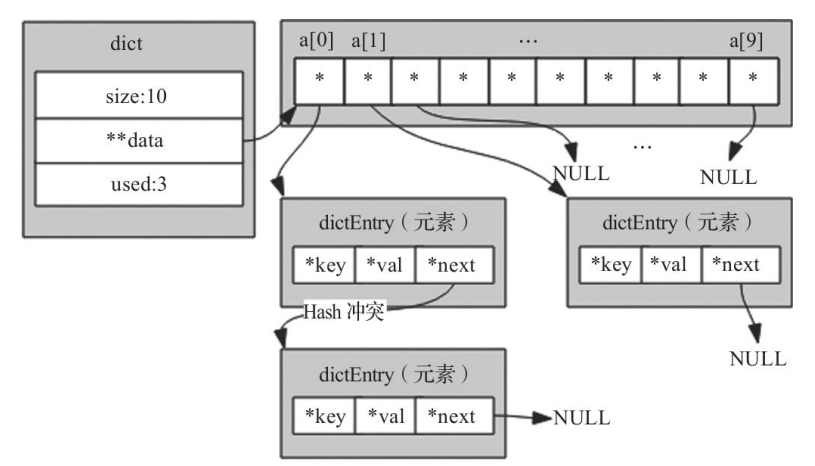

# 简介
字典是redis数据库最基本的结构，其本质结构是hash，用来存储键值对的一种数据结构，Redis本身就是K-V数据库，
整个数据库就是用字典存储的，对于Redis数据库的增、删、改、查操作，实际上都是对字典结构的操作。

## hash函数

对于字典来讲，计算key的hash比较重要，下面是Redis内核里面使用的计算的hash方法: [siphash](./siphash.md) 

```c
static uint8_t dict_hash_function_seed[16];
uint64_t dictGenHashFunction(const void *key, size_t len) {
  return siphash(key,len,dict_hash_function_seed);
}
```
`dictGenHashFunction`函数的主要作用是将任意长度的字符串，计算siphash的值，siphash是一个无符号整型数据。
在Redis当中将任意key转换为无符号整数类型，当作hash结构的下表使用。

## hash冲突

Redis使用hash结构保存数据，那么无法忽略的一个问题就是hash冲突。和hashmap一样，在键冲突的K-V串联成一个
list列表，如下图所示:




一般情况下，根据键查找值分为两步：

- 键通过计算hash值获取索引值，根据索引值找到对应的元素。
- 判断元素中的键与查找的键是否相等，相等则返回值，否则继续判断下一个元素。


# 基本操作


# 字典遍历


