## 简介

跳跃表将有序链表中的部分节点分层，每一层都是一个有序链表。在查找时优先从最高层开始向后查找，当到达某节点时，如果next节点值大于要查找的值或next指针指向NULL，则从当前节点下降一层继续向后查找，这样可以有效提升效率。如下图所示使用跳表查找51的路径为1->21->41->51需要查找4次。如果使用链表查找路径为1->11->21->31->41->51需要查找6次，效率明显提升了，当数据量较大是提升更为明显。

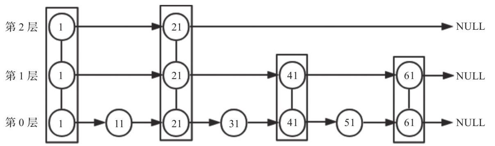

跳跃表的实现过程下图所示：

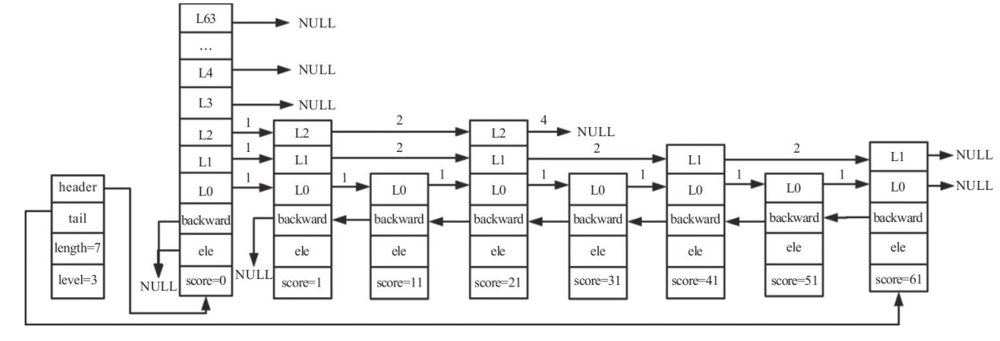


- 跳跃表由很多层构成。
- 跳跃表有一个头（header）节点，头节点中有一个64层的结构，每层的结构包含指向本层的下个节点的指针，指向本层下个节点中间所跨越的节点个数为本层的跨度（span）。
- 除头节点外，层数最多的节点的层高为跳跃表的高度（level），上图中跳跃表的高度为3。
- 每层都是一个有序链表，数据递增。
- 除header节点外，一个元素在上层有序链表中出现，则它一定会在下层有序链表中出现。
- 跳跃表每层最后一个节点指向NULL，表示本层有序链表的结束。
- 跳跃表拥有一个tail指针，指向跳跃表最后一个节点。
- 最底层的有序链表包含所有节点，最底层的节点个数为跳跃表的长度（length）（不包括头节点）。
- 每个节点包含一个后退指针，头节点和第一个节点指向NULL；其他节点指向最底层的前一个节点。


跳跃表每个节点维护了多个指向其他节点的指针，所以在跳跃表进行查找、插入、删除操作时可以跳过一些节点，快速找到操作需要的节点。归根结底，跳跃表是以牺牲空间的形式来达到快速查找的目的。

## 跳跃表数据结构

跳跃表由多个节点构成，每个节点由很多层构成，每层都有指向本层下个节点的指针，接下来讲述跳跃表的数据结构。

### 跳跃表节点结构

下面我们来看跳跃表节点的zskiplistNode结构体:

```c
typedef struct zskiplistNode {
    sds ele;
    double score;
    struct zskiplistNode *backward;
    struct zskiplistLevel {
        struct zskiplistNode *forward;
        unsigned long span;
    } level[];
} zskiplistNode;
```

- ele：用于存储字符串类型的数据。
- score：用于存储排序的分值（todo：分值计算方法）。
- backward：后退指针，只能指向当前节点最底层的前一个节点，头节点和第一个节点——backward指向NULL，从后向前遍历跳跃表时使用。
- level：为柔性数组。每个节点的数组长度不一样，在生成跳跃表节点时，随机生成一个1～64的值，值越大出现的概率越低。level数组的每项包含以下两个元素。
- forward：指向本层下一个节点，尾节点的forward指向NULL。
- span：forward指向的节点与本节点之间的元素个数。span值越大，跳过的节点个数越多。

跳跃表是Redis有序集合的底层实现方式之一，所以每个节点的ele存储有序集合的成员member值，score存储成员score值。所有节点的分值是按从小到大的方式排序的，当有序集合的成员分值相同时，节点会按member的字典序进行排序。

### 跳跃表结构

除了跳跃表节点外，还需要一个跳跃表结构来管理节点，Redis使用zskiplist结构体，定义如下：


```c
typedef struct zskiplist {
    struct zskiplistNode *header, *tail;
    unsigned long length;
    int level;
} zskiplist;
```

- header：指向跳跃表头节点。头节点是跳跃表的一个特殊节点，它的level数组元素个数为64。头节点在有序集合中不存储任何member和score值，ele值为NULL，score值为0；也不计入跳跃表的总长度。头节点在初始化时，64个元素的forward都指向NULL，span值都为0。
- tail：指向跳跃表尾节点。
- length：跳跃表长度，表示除头节点之外的节点总数。
- level：跳跃表的高度。

通过跳跃表结构体的属性我们可以看到，程序可以在O(1)的时间复杂度下,快速获取到跳跃表的头节点、尾节点、长度和高度。

## 跳跃表基本操作
### 创建跳跃

#### 节点层高计算
节点层高的最小值为1，最大值是ZSKIPLIST_MAXLEVEL，Redis 5节点层高的值为64。Redis 6、Redis 7版本节点最高层数为32。官方设计的skiplist最大可以容纳2^64个元素，在函数zslRandomLevel中，ZSKIPLIST_P=0.25，则skiplist最大可以容纳4^64个元素，存在大量的空间浪费，所以将ZSKIPLIST_MAXLEVEL调整为32，减少资源浪费。具体原因可以阅读下面PR：https://github.com/redis/redis/pull/6818 

```c
#define ZSKIPLIST_MAXLEVEL 32 /* Should be enough for 2^64 elements */
```

Redis通过函数zslRandomLevel函数随机生成一个1-32的值，作为新节点的高度。值越大出现的概率越低。节点层高确定之后便不会再修改。生成层高的函数实现如下：

```c/c++
#define ZSKIPLIST_P 0.25      /* Skiplist P = 1/4 */
int zslRandomLevel(void) {
    /* 计算阈值 */
    static const int threshold = ZSKIPLIST_P*RAND_MAX;
    int level = 1; 
    /* 当随机数小于阈值时，level 继续增加 */
    while (random() < threshold)
        level += 1;
    /* 返回 level，同时做不要让 level 大于最大层数的操作 */
    return (level<ZSKIPLIST_MAXLEVEL) ? level : ZSKIPLIST_MAXLEVEL;
}

```
上面代码中，level默认为1，通过while循环，当产生的随机数小于RAND_MAX的最大值的0.25倍时，level的值+1；否则退出循环，最后返回的level值在1-ZSKIPLIST_MAXLEVEL之间。由zslRandomLevel函数的实现可以得出下面结论：

- level在第1层的概率为1-p。
- level在第2层的概率为p(1-p)。
- level在第3层的概率为p^2 (1-p)。
- level在第3层的概率为p^k (1-p)。

#### 初始化表节点

跳跃表的每个节点都是由有序的元素集合。在初始化时，每个节点的层高、score、ele都已经确定，对于每个跳跃表节点我们都需要进行申请内存，进行初始化。初始化代码如下：
```c
zskiplistNode *zslCreateNode(int level, double score, sds ele) {
    zskiplistNode *zn =
        zmalloc(sizeof(*zn)+level*sizeof(struct zskiplistLevel));
    zn->score = score;
    zn->ele = ele;
    return zn;
}
```

在创建节点的时候会申请大小为:`zmalloc(sizeof(*zn)+level*sizeof(struct zskiplistLevel))` 大小的内存，用于存储数据。申请内存时需要指定zskiplistNode 柔性数组的大小，根据柔性数组的大小申请内存。
头节点时比较特殊的节点，头节点的backward指向NULL，初始化的时候，由于头节点为第一个节点，forward为NULL。span为0。初始化代码如下：
```c
for (j = 0; j < ZSKIPLIST_MAXLEVEL; j++) {
     zsl->header->level[j].forward = NULL;
     zsl->header->level[j].span = 0;
}
```

#### 创建跳跃表
创建跳跃表的步骤如下：

- 申请跳跃表内存，申请结构体zskiplist 大小的内存。
- 初始化头节点，具体参考【初始化表节点】。
- 初始化其他信息：长度为0；backward为NULL；tail为NULL；

```c
zskiplist *zslCreate(void) {
    int j;
    zskiplist *zsl;
    zsl = zmalloc(sizeof(*zsl));
    zsl->level = 1;
    zsl->length = 0;
    zsl->header = zslCreateNode(ZSKIPLIST_MAXLEVEL,0,NULL);
    /* 初始化每层跳表 */
    for (j = 0; j < ZSKIPLIST_MAXLEVEL; j++) {
        zsl->header->level[j].forward = NULL;
        zsl->header->level[j].span = 0;
    }
    zsl->header->backward = NULL;
    zsl->tail = NULL;
    return zsl;
}
```

### 插入节点
插入节点是跳表最常见的操作，主要操作流程如下：查找插入位置；调整跳表高度；创建跳表节点，插入新节点；调整backward等；

#### 查找插入位置
查找是跳跃表最常见的操作，主要查找逻辑已经在基本操作里面讲了，主要代码实现如下：

```c
/* 从最高层向下查找插入位置 */
for (i = zsl->level-1; i >= 0; i--) {
     /* rank 存储到达插入位置而跨越的节点数 */
     rank[i] = i == (zsl->level-1) ? 0 : rank[i+1];
     while (x->level[i].forward &&
           (x->level[i].forward->score < score ||
                (x->level[i].forward->score == score &&
                    sdscmp(x->level[i].forward->ele,ele) < 0)))
     {
         rank[i] += x->level[i].span;存储到达插入位置而跨越的节点数
         x = x->level[i].forward;
     }
     update[i] = x;
 }
```
为了找到要更新的节点，我们需要以下两个长度为64的数组来辅助：
- update[]: 插入节点时，需要更新被插入节点每层的前一个节点由于每层更新的节点不一样，所以将每层需要更新的节点记录在update[i]中。
- rank[]:记录当前层从header节点到update[i]节点跨越的步长，在更新update[i]的span和设置新插入节点的span时用到。

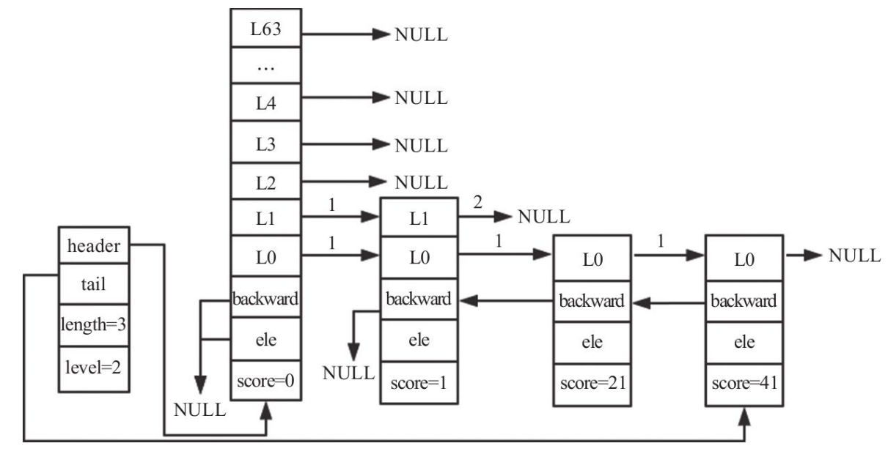

如上图所示跳跃表：长度为3，高度为2。想要插入一个节点，分值为35，层高为3。查找过程如下：
更新后的rank和update如下：
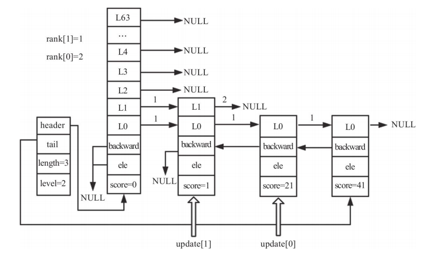


#### 调整跳表高度
插入节点的高度是随机的，假设要插入节点的高度为3，大于跳跃表的高度2，所以我们需要调整跳跃表的高度。代码如下：
```c
/* 获取随机最高层数 */
level = zslRandomLevel();
/* 随机获取的 level 比跳表原来的 level 大，则在比原来 level 高的层级上初始化 rank 和 update  */
if (level > zsl->level) {
    for (i = zsl->level; i < level; i++) {
        rank[i] = 0;
        update[i] = zsl->header;
        update[i]->level[i].span = zsl->length;
    }
    /* 将跳表的 level(最高层数) 替换为随机获取到的 level */
    zsl->level = level;
 }
```
调整高度后的跳跃表如下图所示：

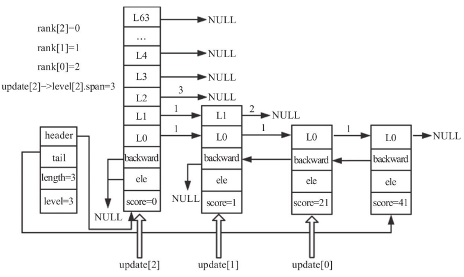

#### 创建跳表及插入节点
当update和rank都赋值且节点已创建好后，便可以插入节点了。创建节点代码如下：
```c
/* 创建一个具有指定层数的跳表节点, SDS字符串 'ele' 在调用后被节点引用 */
zskiplistNode *zslCreateNode(int level, double score, sds ele) {
    zskiplistNode *zn = zmalloc(sizeof(*zn)+level*sizeof(struct zskiplistLevel));
    zn->score = score;
    zn->ele = ele;
    return zn;
}
```
插入节点的代码如下：
```c
/* 插入新节点 */
for (i = 0; i < level; i++) {
    x->level[i].forward = update[i]->level[i].forward;
    update[i]->level[i].forward = x;
    /* 更新 update[i] 所涵盖的跨度，因为有新节点(x)被插入了 */
    /* 首先更新新节点的跨度 */
    x->level[i].span = update[i]->level[i].span - (rank[0] - rank[i]);
    /* 更新 update 的跨度 */
    update[i]->level[i].span = (rank[0] - rank[i]) + 1;
}
```
插入节点并更新第0层后的跳跃表如下所示：

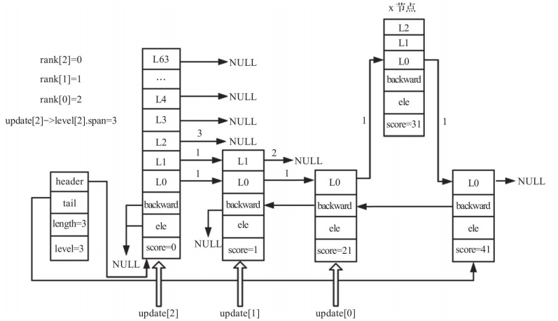

插入节点并更新第1层后的跳跃表如下：
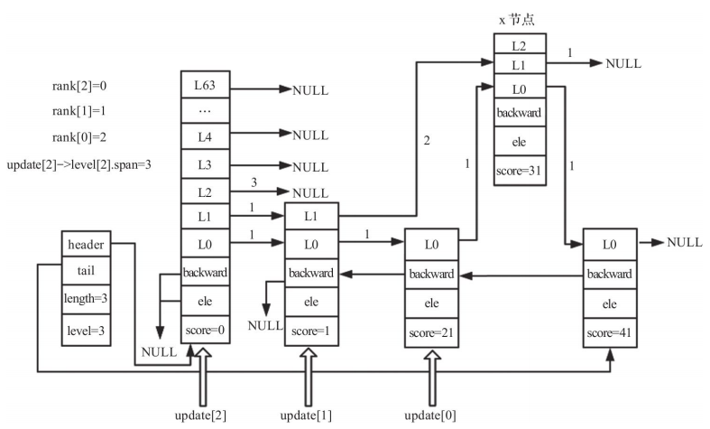

插入节点并更新第2层后的跳跃表如下：
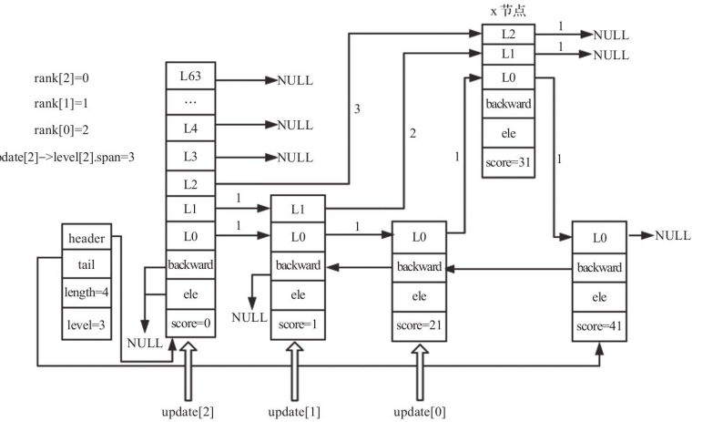

#### 调整backward等
调整插入节点与跳表最高层之间的跨度，代码如下：
```c
/* 对未触及到的层数（插入节点的最高层与整个跳表中最高层之间）更新跨度 */
for (i = level; i < zsl->level; i++) {
    update[i]->level[i].span++;
}
```
跟新backward指针，代码如下：
```c
x->backward = (update[0] == zsl->header) ? NULL : update[0];
    /* 设置新节点的下一个节点的后向指针，若下一个节点不存在，则将尾指针指向新节点 */
    if (x->level[0].forward)
        x->level[0].forward->backward = x;
    else
        zsl->tail = x;
```

跳表最终结果如下：
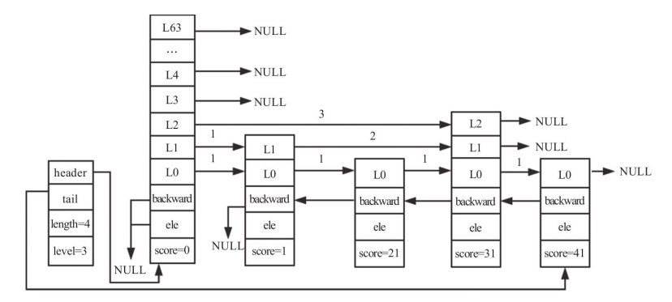

### 删除节点

删除节点的步骤主要如下：
- 查找需要删除的节点。
- 设置span和forward。

#### 查找需要删除的节点
查找需要删除的节点参考查找插入位置章节。

#### 设置span和forward
更新span代码如下：
```c
/* 更新 update[i] 的前向指针以及跨度 */
    for (i = 0; i < zsl->level; i++) {
        if (update[i]->level[i].forward == x) {
            update[i]->level[i].span += x->level[i].span - 1;
            update[i]->level[i].forward = x->level[i].forward;
        } else {
            update[i]->level[i].span -= 1;
        }
    }
```
跟新forward代码如下：
```c
/* 更新 x（被删除节点） 的下一个节点的后向指针，如果下一个节点不存在，则将尾指针指向 x 的上一个节点 */
    if (x->level[0].forward) {
        x->level[0].forward->backward = x->backward;
    } else {
        zsl->tail = x->backward;
    }
```    
若被删除节点拥有最高的层数，则需要将跳表的最高层数下调至当前剩余节点中的最高层。
```c
while(zsl->level > 1 && zsl->header->level[zsl->level-1].forward == NULL)
        zsl->level--;
    zsl->length--;
```    
设置span和forward后的跳跃表如下：
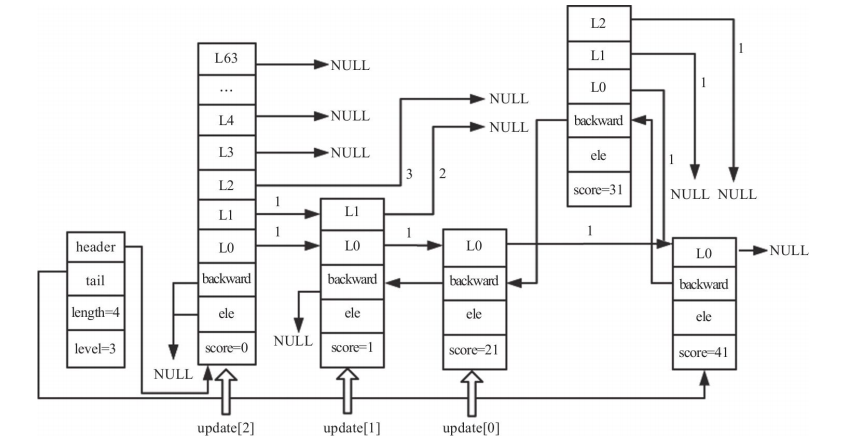

### 删除跳跃表

当删除跳跃表时，从头节点的第0层开始，通过forward指针逐步向后遍历，每遇到一个节点便将释放其内存。当所有节点的内存都被释放之后，释放跳跃表对象，即完成了跳跃表的删除操作，代码如下：
```c
/* 释放整个跳表 */
void zslFree(zskiplist *zsl) {
    zskiplistNode *node = zsl->header->level[0].forward, *next;
    /* 释放头指针 */
    zfree(zsl->header);
    /* 遍历并释放剩下的所有节点 */
    while(node) {
        next = node->level[0].forward;
        zslFreeNode(node);
        node = next;
    }
    /* 释放跳表结构 */
    zfree(zsl);
}
```
释放指定的跳表节点。成员的引用 SDS字符串 也会被释放，除非在调用此函数之前将 node->ele 设置为 NULL，代码如下：
```c
void zslFreeNode(zskiplistNode *node) {
    sdsfree(node->ele);
    zfree(node);
}
```

### 跳跃表的应用和优化

#### 应用场景

跳跃表主要是zset底层实现的一种，zset中字典和布局如下所示：
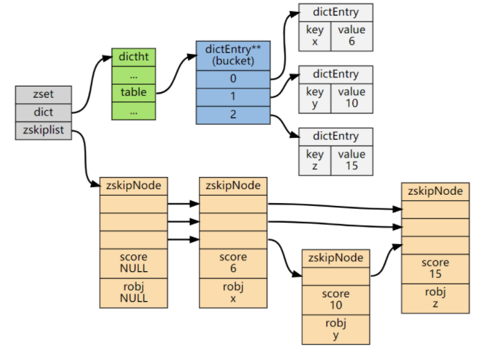

##### 排行榜
有序集合经典使用场景。例如视频网站需要对用户上传的视频做排行榜，榜单维护可能是多方面：按照时间、按照播放量、按照获得的赞数等

##### 带权重的队列

#### 相关参数
skiplist相关的参数以及功能如下：

| 配置参数 | 默认值 | 备注 |
|--- | ---| ---|
| zset-max-listpack-entries | 128 | 当zset中的元素数目大于128的时候底层实现会使用qucklist |
| zset-max-listpack-value | 64 | 当zset中value最大value超过64bit时，底层实现会使用qucklist |

